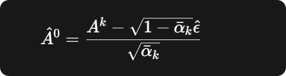

# p1
再简单写完v1,的时候，train的时候一切正常，但是inference的时候直接loss爆炸，发现是action直接发散了： gpt给出的是 多步推理会累积模型误差  
solution1： 改noise_schedule v1 是线性的，A99的噪声都不算很高  -需要的是从 1平滑的变到0
还是不行，然后有两种可能性： 1。高噪声的数据没学会怎么处理   2.采样问题

1/a爆炸了

对数据太敏感了.

Compare with flow：
Diffusion： 
>TIME:  5.408592100022361
>MAE:  0.03080573832266964
Flow-matching:
>TIME:  0.641774500021711
>MAE:  0.035128375922795385